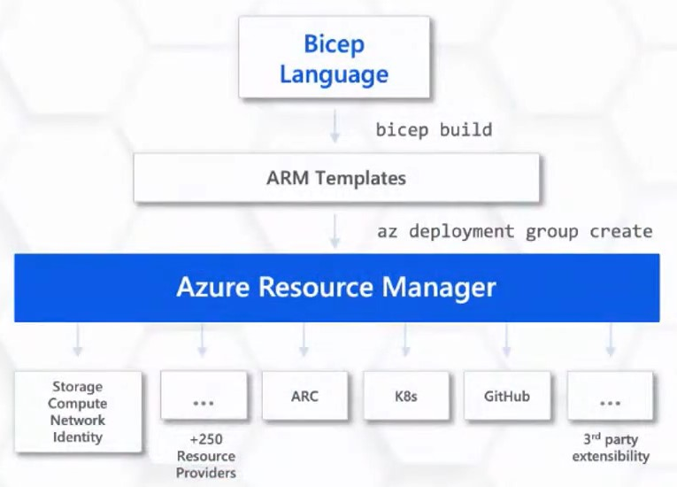

# What is Bicep?

## Bicep is a Domain Specific Language (DSL) for Azure Resource Manager (ARM) templates

* Bicep is a declarive language to provision infrastructure on Azure that is easy to read, write, and deploy.
* Bicep is a **strongly typed** language that **compiles** down to ARM templates and **enforces** best practices.

# Benefits of Azure Bicep

## Simple declarative files for creating Azure resources in a reliable, repeatable and auditable way.

### Simpler Syntax. No JSON noise

Define Azure resources using a simple language to learn, read and understand. Bicep aims to drastically simplify the authoring experience (compared to ARM) with a cleaner syntax and better support for modularity and code re-use.

### Declarative Syntax

Declare how the resources should be and Azure Resource Manager "makes it so".

### Modularity

Modules to break your bicep code into manageable chunks. Public and Private module registries.

### Built for tool-ability

First class authoring experience in VS Code. Rich type-safety, intellisense and validation.

### Convert existing templates

Easy conversion to ARM Templates to Bicep.

# Why use Bicep over other tools?

### Day zero support for all resource types & API versions

New resources are supported immediately

### No state files

Azure **is** the state

### Preflight validation

Fails fast

### Tooling

VS Code extension, Azure CLI, Azure PowerShell, Bicep Playground

### Support

100% supported by Microsoft Support Plans

# Learn More

## https://aka.ms/BicepDocs

## https://github.com/Azure/bicep

| [<== Previous Section: Requirements](Requirements.md) | [Back to Main](../README.md) |
|--|--|
